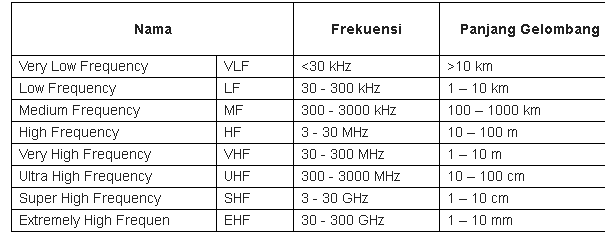

# Sinyal RF(Radio Frekuensi), Infrared, Bluetooth, WiFi

### Pengertian Sinyal RF
Sinyal RF merupakan gelombang elektromagnetik yang digunakan oleh sistem komunikasi untuk mengirim informasi melalui udara dari satu titik ke titik lain. Sinyal RF telah digunakan selama beberapa tahun. Sinyal tersebut memberikan cara untuk mengirimkan musik pada radio FM dan video pada televisi. Pada kenyataannya, sinyal RF juga merupakan sarana umum untuk mengirim data melalui jaringan wireless.

### Jenis gelombang radio, diantaranya :

### Sifat-Sifat Sinyal RF :
  Sinyal RF merambat di antara antena pemancar pengirim dan penerima. Seperti yang diilustrasikan Gambar 2.8, sinyal yang dipasok pada antena memiliki amplitudo, frekuensi, dan interval.
  Amplitudo mengindikasikan kekuatan sinyal. Ukuran untuk amplitudo biasanya berupa energi yang dianalogikan dengan jumlah usaha yang digunakan seseorang pada waktu mengendarai sepeda untuk mencapai jarak tertentu.
  Saat sinyal radio merambat melalui udara, sinyal tersebut kehilangan amplitudo. Jika jarak antara pengirim dan penerima bertambah, amplitudo sinyal menurun secara eksponensial. Pada lingkungan yang terbuka, di mana tidak ada rintangan, sinyal RF mengalamai apa yang disebut para engineer sebagai free-space loss yang merupakan bentuk dari pelemahan. Kondisi tersebut menyebabkan sinyal yang telah dimodulasi melemah secara eksponensial saat sinyal merambat semakin jauh dari antena.

# Infrared
Radiasi yang ditemukan oleh William Herschell ini merupakan sebuah radiasi elektromagnetik yang memiliki panjang gelombang yang terlihat lebih pendek dari gelombang radio dan lebih dari panjang dari cahaya yang terlihat. Panjang gelombangnya antara 700 nm dan 1 mm.

Adanya gelombang infrared ini tidak terlepas dari sumbernya. Sumber dari infrared adalah sinar matahari langsung. Di dalam sinar matahari ini terdapat 93 lumens per watt flux radian yang memiliki tiga gelombang cahaya. Yang pertama adalah cahaya ultra violet sebesar 6%, kemudian ada cahaya tampak sebesar 46%, dan inframerah sebesar 47%.

Tidak hanya dari sinar matahari, sumber inframerah juga bisa didapatkan dari cahaya lainnya seperti cahaya api atau pantulan jalan aspal yang terkena panas. Radiator kendaraan juga ternyata bisa menghasilkan infrared.

## Jenis - Jenis Infrared

### 1. Infrared Jarak Dekat
Jenis pertama adalah infrared jarak dekat. Disebut jarak dekat karena infrared ini memiliki panjang gelombang 0.75 µm sampai 1.5 µm. Contoh alat yang memanfaatkan infrared jarak dekat adalah Nightscoop yakni alat untuk mencitrakan pandangan pada malam hari.

### 2. Infrared Jarak Menengah
Jenis kedua adalah infrared jarak menengah. Jenis infrared ini memiliki panjang gelombang lebih dari 1.5 µm. Kisaran angka panjang gelombangnya adalah 1.5 µm sampai 10 µm. Contoh alat yang memanfaatkan infrared jarak menengah adalah sensor alarm.

### 3. Infrared Jarak Jauh
Jenis infrared ketiga adalah infrared jarak jauh. Jenis infrared ini memiliki panjang gelombang 10 µm sampai 100 µm. Jenis alat yang memanfaatkan infrared jarak jauh adalah beberapa alat kesehatan.

## Contoh Infrared
- Thermometer
- Room Temperatur
- NightScoop/NightVision
- Sensor Alarm

# Bluetooth
Bluetooth merupakan sebuah teknologi berjenis wireless atau nirkabel. Teknologi ini dikembangkan oleh BSIG atau Bluetooth Special Interest Group. Bluetooth berguna untuk memindahkan data dari satu perangkat ke perangkat lainnya tanpa memerlukan kabel. Jarak yang diperlukan Bluetooth untuk dapat berkomunikasi antar perangkat yaitu antara 1 hingga 100 meter.

### Jenis-Jenis Bluetooth Berdasarkan Versinya
1. Bluetooth 1.0 dan 1.0B
Versi awal dari teknologi Bluetooth ini memiliki perkembangan yang kurang baik. Banyaknya permasalahan yang dimiliki Bluetooth versi ini menyebabkan pabrikan kesulitan membuat teknologi tersebut beroperasi di produk-produk mereka.

2. Bluetooth 1.1
Versi ini muncul dengan perbaikan dari versi Bluetooth sebelumnya. Selain itu, Bluetooth 1.1 juga telah memiliki standar IEEE 802.15.1-2002.

3. Bluetooth 1.2
Dibanding tiga versi Bluetooth sebelumnya, Bluetooth 1.2 tentu saja memiliki banyak keunggulan. Pada prakteknya Bluetooth versi ini memiliki kecepatan transmisi yang lebih tinggi, yaitu hingga 721 Kbit per detik. Versi ini juga memungkinkan penggunanya untuk menemukan koneksi Bluetooth lain lebih cepat.

4. Bluetooth 2.0 + EDR
Dengan teknologi EDR (Enhanced Data Rate) yang dimilikinya, Bluetooh versi 2.0 memiliki transfer data yang lebih cepat. Walaupun teknologi EDR memiliki kecepatan 3 Mbit per detik, namun transfer data maksimum pada Bluetooth versi ini adalah 2.1 Mbit per detik. Bluetooth versi 2.0 +EDR hadir pada tahun 2004.

5. Bluetooth 2.1 + EDR
Tiga tahun berselang, versi Bluetooth yang lebih tinggi hadir, yaitu versi 2.1 + EDR. Teknologi utama pada Bluetooth versi ini adalah SSP atau Secure Simple Pairing. Dengan SPP pengalaman menggunakan Bluetooth jadi lebih baik, terutama dalam hal pairing dan keamanan.
Teknologi lain yang hadir pada Bluetooth versi ini adalah EIR atau Extended Inquiry Response. Teknologi ini membantu pengguna mengetahui informasi perangkat yang akan dihubungkan sebelum koneksi dimulai. Selain itu, EIR juga membantu perangkat mengurangi konsumsi daya pada low-power mode.

6. Bluetooth 3.0 + HS
Bluetooth versi 3.0 + HS hadir dua tahun pasca perilisan versi 2.1 + EDR. HS pada Bluetooth versi ini adalah singkatan dari High Speed di mana teknologi yang digunakan adalah link 802.11. Selain itu, Bluetooth versi 3.1 + HS memiliki fitur baru yang disebut AMP atau Alternative MAC/PHY.

## WiFi
Wifi adalah sebuah teknologi yang menggunakan gelombang radio (secara nirkabel) melalui jaringan computer untuk bertukar data, termasuk koneksi internet yang memiliki kecepatan tinggi.
WIFI adalah produk jaringan area local nirkabel atau yang biasa disebut dengan WLAN. Istilah “WLAN”, walaupun merupakan kata sinonim dari WIFI, saat ini sudah jarang digunakan.

## Fungsi Wifi dan Cara Kerja Wifi
Untuk dapat menggunakan WIFI, sebuah perangkat keras seperti Komputer, Laptop, Smartphone, Tablet, dan Pemutar audio digital membutuhkan sebuah titik akses jaringan nirkabel sehingga internet dapat digunakan. Titik Akses ini memiliki jangkauan tertentu tergantung dengan perangkat yang digunakan dan luasnya bidang/ruangan. Untuk Cakupan wilayah yang lebih luas dibutuhkan beberapa titik akses dengan cakupan yang saling tumpang tindih. Kunci yang memungkinkan komunikasi dalam jaringan wifi adalah Sinyal Radio. Wifi mengkoneksikan perangkat dengan internet tanpa menggunakan kabel.

# Encoding
Encoding adalah proses mengubah pikiran menjadi komunikasi. Encoder menggunakan ‘media’ untuk mengirim pesan, panggilan telepon, email, pesan teks, pertemuan tatap muka, atau alat komunikasi lainnya. Tingkat pemikiran sadar yang masuk kepesan penyandian dapat bervariasi.
Dalam dunia komputer, apa yang dilakukan encoding karakter bit adalah memisahkan bit ini menjadi masing-masing kelompok n bit, dan menetapkan simbol untuk setiap urutan yang diperoleh. Dengan cara sederhana, pengkodean karakter atau rangkaian karakter dapat dianggap sebagai tabel terjemahan, dimana setiap kelompok bit terkait dengan satu karakter.
Misalnya, pengkodean karakter 8-bit dapat mewakili urutan “10010101” sebagai huruf “a”, urutan “01101100” sebagai simbol “&”, dan seterusnya. Jika Anda melihat dari dekat, Anda akan melihat bahwa tidak ada kode yang diulang.

## Macam-Macam Kode
### 1.Kode Baudot
Berawal dari kode morse. Ada kode 4-an, 5-an, 6-an, dan 8-an yang digunakan untuk pengiriman telegraph yang disimpan di pita berupa lubang tutup. Untuk lubang sebanyak 6x berturut-turut disebut sebagai kode 6-an.

### 2.Standard Code (Americank figure. for Information Interchange).
Didefinisikan sebagai kode 7 bit (sehingga dapat dibuat 128 karakter). Masing-masing yaitu 0-32 untuk karakter kontrol (unprintable) dan 32-127 untuk karakter yang tercetak (printable). Dalam transmisi synkron tiga karakter terdiri dari 10 atau 11 bit : 1 bit awal, 7 bit data, 1 atau 2 bit akhir dan 1 bit paritas.

### 3.Kode 4 atau Kode 8.
Kombinasi yang diijinkan adalah 4 bit “1” dan 4 bit “0” sehingga dapat dibuat kombinasi 70 karakter.

### 4.Kode BCD (binary code desimal).
Terdiri dari 6 bit perkarakter dengan kombinasi 64 karakter. Untuk asynkron terdiri dari 9 bit: 1 bit awal, 6 bit data, 1 bit paritas dan 1 bit akhir.

### 5.Kode EBCID.
Menggunakan 8 bit perkarakter dengan 256 kombinasi karakter.
Asynkron: 1 bit awal, 8 bit data, 1 bit paritas dan 1 bit akhir.
